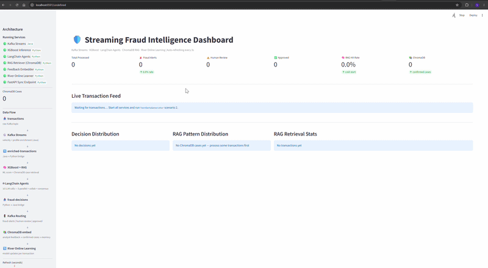
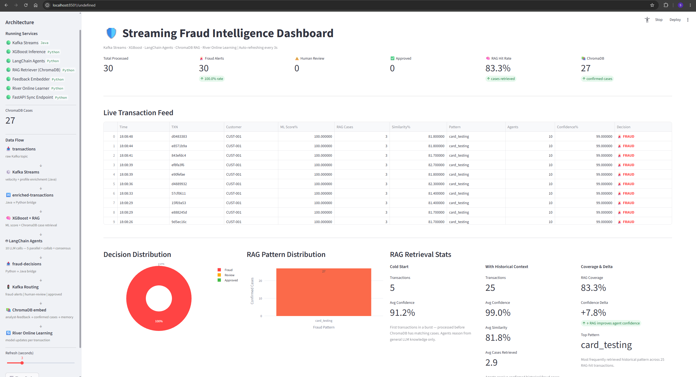
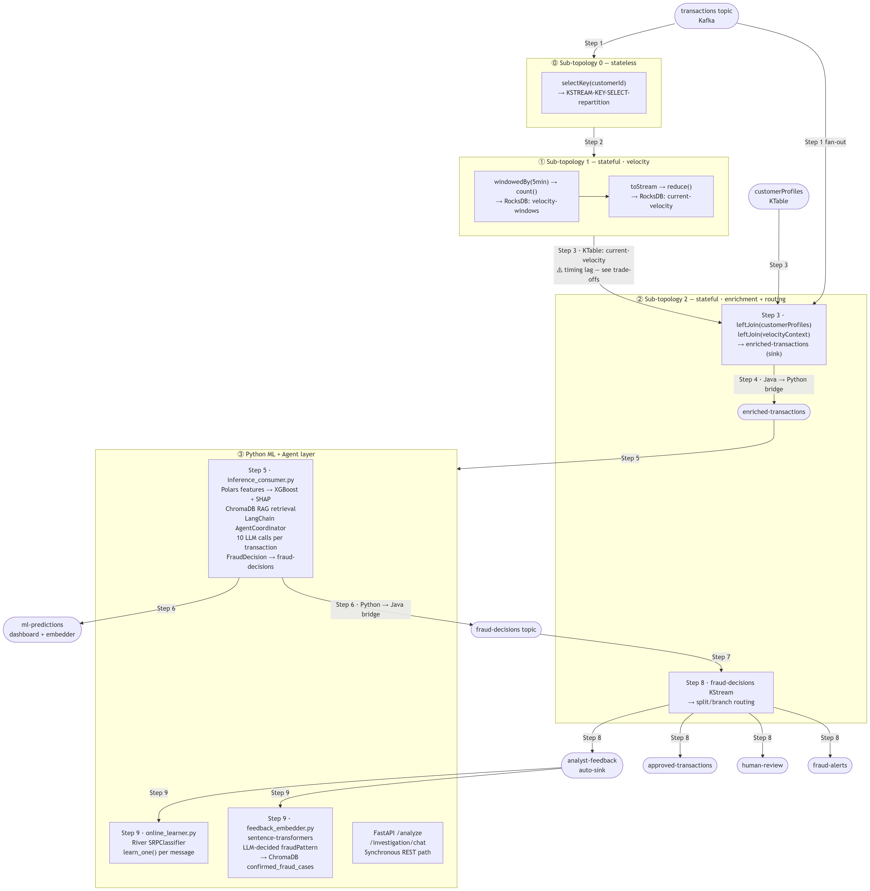
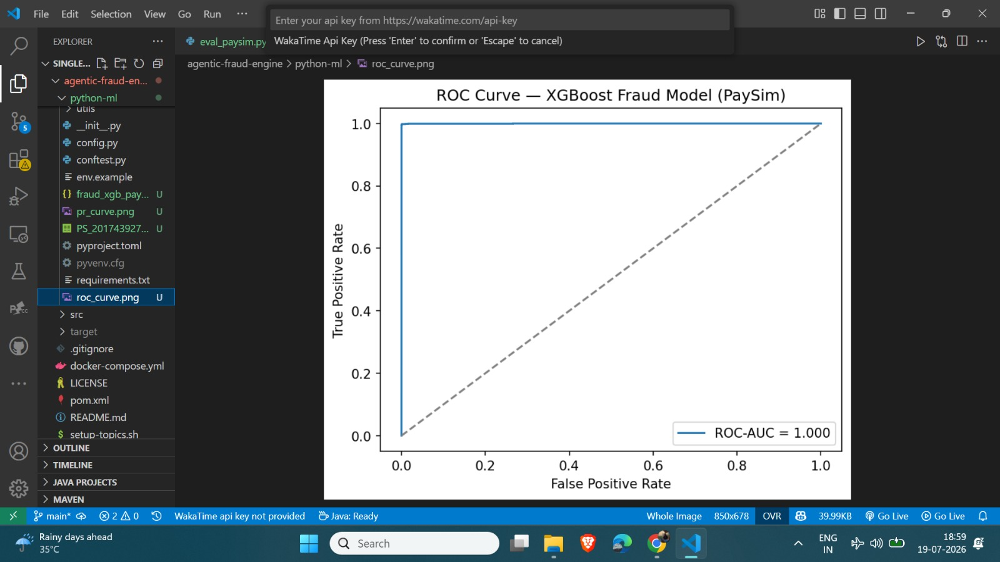
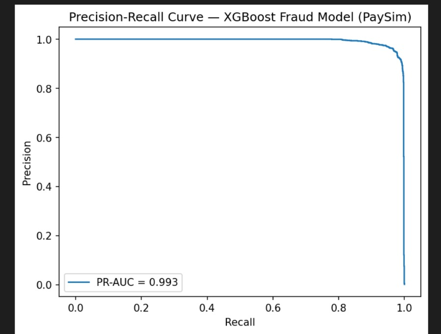

# Streaming Fraud Intelligence

> **Kafka Streams + XGBoost + LangChain Agents + ChromaDB RAG + River Online Learning — a self-improving fraud detection pipeline**

A hybrid Java/Python fraud detection system combining Kafka Streams real-time enrichment, XGBoost ML inference with SHAP explainability, ChromaDB RAG (historical and confirmed fraud case retrieval with chain-of-thought agent guidance), LangChain multi-agent LLM analysis, River and synchronous FastAPI endpoints — all wired as a continuous feedback loop.

[](https://www.linkedin.com/in/anshivya-nagpal-18a75b315/)

---

## See It In Action



> Real-time Streamlit dashboard: live transaction feed with LLM-decided fraud patterns, RAG similarity scores, agent consensus, and a ~8% confidence improvement panel showing the measurable impact of ChromaDB historical case retrieval on agent reasoning.


---

## What this project covers

Five layers running concurrently and feeding each other:

1. **Kafka Streams** `Java` — real-time velocity windows, customer profile KTable joins,
    enriched-transactions topic
2. **XGBoost + SHAP** `Python` — ML inference with explainability, 19 engineered features via Polars,
   StandardScaler, SHAP TreeExplainer top-3 contributions per prediction
3. **ChromaDB RAG** `Python` — confirmed fraud cases embedded via sentence-transformers,
   retrieved at inference time with chain-of-thought agent guidance
4. **LangChain Agents** `Python / Groq` — 5 specialized agents running 10 LLM calls per
   transaction across parallel and collaborative phases, with LangSmith observability
5. **River Online Learning** `Python` — `SRPClassifier` updating from the analyst-feedback
   Kafka topic in real time, no retraining cycle required

Each layer feeds the next and the last feeds back into the first — analyst decisions flow
back through Kafka into ChromaDB and River, making the system more accurate over time
without manual intervention.

---

## The Problem

**Rule-based systems** catch known patterns but miss novel attacks:

- Rules are static — new fraud vectors require manual updates that lag weeks behind attackers
- Context is ignored — a $30 transaction triggers or does not trigger the same rule
  regardless of whether the customer's average is $20 or $2,000
- Combinatorial explosion — detecting fraud that requires 5! signals together means
  writing 5! rule combinations manually

**LLM-only systems without streaming context** reason well but reason blind:

- Every transaction is analyzed in isolation — no awareness of the last 5 minutes
- No customer baseline — an LLM cannot know whether $30 is normal or anomalous
  for a specific customer without real-time profile context
- No memory — without RAG, agents have no knowledge of confirmed fraud cases
  from your own system's history

**Example:** A $30 transaction looks normal in isolation. With streaming context:

- Customer average: $244 → amount is 87% below baseline
- 15 transactions in the last 5 minutes → velocity attack in progress
- Bot device ID + suspicious merchant + unknown location → automated attack

→ **Card testing attack detected at 99.0% confidence with RAG historical context**

This system addresses both gaps: Kafka Streams provides the real-time context
that LLMs lack, and RAG provides the institutional memory that rules cannot encode.

---

## Architecture



**Key architectural decision:** All ML inference and LLM agent reasoning runs in Python. 
Java owns stateless and stateful stream processing layers (repartition, velocity windows, KTable joins, and
routing). Python owns the entire intelligence layer. The two platforms communicate via Kafka topics.

---

## LLM Agent Pipeline (10 LLM calls per transaction)

Three phases in `python-ml/agents/agent_coordinator.py`:

**Phase 1: The 5 specialized agents in parallel** (`ThreadPoolExecutor`, mirrors Java `CompletableFuture`):

| Agent             | Specialization                    | Weight |
|-------------------|-----------------------------------|--------|
| BehaviorAnalyst   | Velocity + spending deviation     | 1.2x   |
| PatternDetector   | Known attack signatures           | 1.3x   |
| RiskAssessor      | Financial risk + customer profile | 1.1x   |
| GeographicAnalyst | Location anomaly + VPN detection  | 1.0x   |
| TemporalAnalyst   | Timing patterns + bot indicators  | 1.0x   |

**Phase 2: The collaboration (parallel, triggered by velocity or customer profile):**

- PatternDetector + TemporalAnalyst debate the velocity question (+2 LLM calls)
- BehaviorAnalyst + RiskAssessor debate the customer profile question (+2 LLM calls)

**Phase 2c: The consensus** (`STREAMING_CONSENSUS_COORDINATOR`, weight 0.8x, +1 LLM call):
Reads all preceding insights + RAG context and outputs `RISK_SCORE`, `REASONING`,`RECOMMENDATION`, and `PATTERN`.

**Phase 3: The decision synthesis** (no additional LLM call):
Consensus coordinator's `RISK_SCORE` is used directly as confidence — the LLM assesses its own certainty rather than a hardcoded tier formula.

Total wall-clock time per transaction: **1.5–2.7 seconds** (Groq API latency ~300–400ms per call)

### Chain-of-thought RAG guidance

Each agent receives a specialisation-specific instruction injected only when confirmed historical cases are present in the streaming context:

```python
# BehaviorAnalyst — injected when ChromaDB cases are retrieved
"""As a BEHAVIOR ANALYST: if similar confirmed cases show the same velocity spending deviation pattern, 
weigh this heavily in your RISK_SCORE. Confirmed historical cases with matching behavioral signatures are strong 
evidence of the same attack type."""
```

Without this explicit guidance, agents acknowledge historical cases in their reasoning text but do not reliably change 
their numerical RISK_SCORE. With it, confidence increases measurably when confirmed similar cases are available.

---

## Python ML Layer

### Feature engineering (`features/engineer.py`)

19 features extracted from `EnrichedTransaction` using **Polars**:

```
amount_ratio, daily_limit_ratio, is_amount_unusual, velocity_count, velocity_squared, is_high_velocity (>= high_velocity_threshold from config)
is_unknown_location, is_primary_location, is_different_city, is_online, is_typical_category, is_suspicious_merchant
hour, is_off_hours, is_weekend, is_high_risk_customer, is_low_risk_customer, is_bot_device, is_rapid_fire
```

### XGBoost inference + SHAP (`consumers/inference_consumer.py`)

- Pre-trained XGBoost model with StandardScaler applied at inference time (training-serving skew prevention)
- SHAP TreeExplainer top-3 feature contributions per prediction - used for explainability 
- Publishes `MLPrediction` to `ml-predictions` topic including `ragContext` field (consumed by dashboard + ChromaDB embedder)
- Publishes `FraudDecisionOutput` to `fraud-decisions` (consumed by Java for routing)
- MLflow experiment tracking for training runs

### Online learning (`training/online_learner.py`)

- **River `SRPClassifier`** (Streaming Random Patches — designed specifically for concept drift in streaming data)
- `learn_one()` called per `analyst-feedback` message — model updates in microseconds, no retraining cycle
- Tracks rolling ROCAUC metric, logs progress every 100 updates

### FastAPI synchronous endpoints (`api/server.py`)

```bash
python -m api.server  # http://localhost:8000
```

- `POST /analyze` — full ML + agent pipeline for ad-hoc transaction analysis
- `POST /investigation/chat` — conversational Q&A about the system (LangChain + Groq)
- `GET /health` — checks AgentCoordinator, RAGRetriever, ChatGroq

Java controllers (`FraudDetectionController`, `ConversationalController`) proxy to these endpoints via `RestTemplate`.

---
## Offline Evaluation (PaySim Benchmark)

[#offline-evaluation-paysim-benchmark](#offline-evaluation-paysim-benchmark)

To validate the XGBoost model itself (separate from the live agent pipeline), it was trained and evaluated offline on the [PaySim](https://www.kaggle.com/datasets/ealaxi/paysim1) synthetic mobile-money fraud dataset — 6.36M transactions, 0.13% fraud rate, stratified 80/20 train/test split.

| Metric | Value |
|---|---|
| Precision (fraud) | 0.8757 |
| Recall (fraud) | 0.9945 |
| F1-score (fraud) | 0.9313 |
| ROC-AUC | 0.9998 |
| PR-AUC | 0.9932 |

**Confusion matrix** (test set, 1,272,524 transactions):

|  | Predicted: not fraud | Predicted: fraud |
|---|---|---|
| **Actual: not fraud** | 1,270,649 | 232 |
| **Actual: fraud** | 9 | 1,634 |

The model catches 99.45% of fraud in the test set (9 missed out of 1,643), at a false-positive cost of 232 legitimate transactions flagged incorrectly.




**Note on interpretation:** PaySim's fraud transactions follow synthetically distinct patterns (specific transaction types combined with balance-draining behavior), which makes them easier to separate than real-world fraud. These metrics validate the model's mechanics — feature engineering, class-imbalance handling, threshold behavior — rather than guaranteeing equivalent performance on production data.

## RAG Pipeline (ChromaDB + sentence-transformers)

### Why RAG in a fraud detection system

Without RAG, agents reason from their general LLM training knowledge — they know what
card testing "typically" looks like from pre-training, but they have no knowledge
of the specific fraud cases your system has already confirmed.

With RAG, agents reason from your system's own confirmed history. When a new
transaction arrives, the 3 most similar confirmed cases are retrieved from ChromaDB
and injected directly into every agent's prompt:

```
SIMILAR CONFIRMED FRAUD CASES FROM HISTORY:

Case 1 (similarity: 82%, pattern: card_testing, confidence: 1.00, confirmed: 2026-06-28):
  fraud pattern: card_testing
  velocity: 15 transactions in 5 minutes (high velocity attack)
  merchant: suspicious online (atypical category)
  location: unknown/vpn
  device: bot device detected
  outcome: FRAUD CONFIRMED — 10 agents agreed, confidence 1.00

Case 2 (similarity: 79%, pattern: card_testing, confidence: 1.00, confirmed: 2026-06-29):
  ...

Case 3 (similarity: 76%, pattern: vpn_bot_fraud, confidence: 0.85, confirmed: 2026-06-30):
  ...

Use these cases as precedent. Higher similarity = more relevant to current transaction.
```
---

### How it works

**Embedding** (`agents/feedback_embedder.py`):
- Subscribes to both `ml-predictions` and `analyst-feedback` topics via a single consumer
- Embeds confirmed fraud cases using `sentence-transformers all-MiniLM-L6-v2`
- **LLM-decided pattern:** `fraudPattern` field from `analyst-feedback` (set by the
  consensus coordinator) is stored as ChromaDB metadata — replaces the previous
  rule-based `_detect_fraud_pattern()` which misclassified early-burst transactions
  due to KTable timing lag
- Pending-buffer pattern handles cross-topic ordering: `analyst-feedback` consistently
  arrives before its matching `ml-predictions` in the same poll cycle — feedback is
  buffered until features are available
- Cold-start filtering: The first couple of transactions with `velocity_count <= 1` and `ml_score < 0.01`
  are skipped — timing lag artifacts that would poison ChromaDB with wrong pattern labels
- Self-bootstrapping: TXN #4 in an attack retrieves cases embedded by TXN #3 in the same run

**Retrieval** (`agents/rag_retriever.py`):
- Called at inference time in `inference_consumer.py` — RAG context is available
  to Python agents immediately
- Dual-query: customer-specific cases (priority) + general similar cases (deduplicated)
- Pure cosine similarity — velocity metadata filter removed after LLM-driven pattern
  classification ensured ChromaDB stores correct `card_testing` labels consistently
- Minimum similarity threshold: 0.50 cosine distance
- Results injected into `streaming_context` string → passed directly to all 5 LangChain
  agents and the consensus coordinator as chain-of-thought RAG guidance

### LLM-driven fraud pattern classification

The `STREAMING_CONSENSUS_COORDINATOR` outputs a `PATTERN:` field alongside
`RISK_SCORE:`, `REASONING:`, and `RECOMMENDATION:`. This LLM-decided pattern
flows through the entire pipeline:

```
LLM: PATTERN: card_testing
→ FraudDecisionOutput.fraudPattern
→ fraud-decisions Kafka topic
→ Java createFeedbackRecord() → analyst-feedback
→ feedback_embedder embeds case as card_testing in ChromaDB
→ future retrievals return card_testing for similar attacks
```

This replaces the previous rule-based `_detect_fraud_pattern()` which used
velocity thresholds that misclassified early-burst transactions due to KTable
timing lag. The LLM correctly identifies `card_testing` even when `is_high_velocity=0`
by reasoning from `is_rapid_fire`, `is_bot_device`, velocity count, and amount ratio
together.

### Measured impact
| Metric               | Cold Start (no RAG) | With Historical Context |
|----------------------|---------------------|-------------------------|
| Avg agent confidence | 91.2%               | 99.0%                   |
| Transactions         | 5                   | 25                      |
| Avg similarity       | —                   | 81.8%                   |
| Avg cases retrieved  | —                   | 2.9                     |
| RAG coverage         | —                   | 83.3%                   |
| **Confidence delta** | —                   | **+7.8%**               |

Cold start confidence remains high (91%+) because agents reason correctly
from raw transaction signals (bot device, VPN, suspicious merchant, rapid
fire) independent of ML score or historical context — demonstrating the
four-layer compensation mechanism. RAG pushes certainty from high to
near-certain.
The delta is LLM-driven — agents explicitly instructed to weight confirmed historical
cases score measurably higher when similar cases are available. No formula is involved.

---

## Real-time Dashboard (Streamlit)

`python-ml/monitoring/dashboard.py` — auto-refreshes every 3 seconds.

```bash
cd python-ml
streamlit run monitoring/dashboard.py  # http://localhost:8501
```

**Panels:**

- Running Services sidebar with Java/Python language tags and Data Flow stages
- Live Transaction Feed: ML score, RAG cases, similarity, LLM-decided pattern,
  agent count, confidence, decision (colour-coded)
- Decision Distribution donut chart (Fraud / Review / Approved)
- RAG Pattern Distribution bar chart (from ChromaDB — LLM-decided patterns)
- RAG Retrieval Stats: Cold Start vs With Historical Context confidence comparison,
  +10.0% delta, coverage %, top pattern

**LangSmith** traces every LLM call with input prompt, output, latency, and token
count — full end-to-end observability at `https://smith.langchain.com`.

---

## Real Detection Examples

### Example 1 — High-confidence fraud (98.5% confidence, 10 agents)

**AUTO-BLOCKED** → `fraud-alerts`

```
Customer: CUST-001 | avg $244 | HIGH risk
Transaction: $30 | MERCHANT-SUSPICIOUS-7 | ONLINE | Unknown Location
Context: 15 transactions in 5 minutes | BOT-DEVICE-1 | rapidFire=true
RAG: 3 confirmed card_testing cases at 79-82% similarity
```

| Agent             | Risk | Key finding                                                       |
|-------------------|------|-------------------------------------------------------------------|
| BehaviorAnalyst   | 95%  | High velocity highly unusual small amounts = detection avoidance  |
| PatternDetector   | 95%  | Matches card testing: rapid + small + suspicious merchant         |
| RiskAssessor      | 85%  | HIGH risk customer, RAG: 3 confirmed cases at 82%  similarity     |
| GeographicAnalyst | 95%  | Unknown location = VPN/proxy confirmed by historical cases        |
| TemporalAnalyst   | 95%  | Sub-second intervals = bot automation                             |
| Consensus         | 99%  | All evidence combined — high similarity to confirmed fraud        |

---

### Example 2 — Human review (85% confidence, 8 agents)

**ANALYST REQUIRED** → `human-review`

```
Customer: CUST-001 | avg $392 | HIGH risk
Transaction: $30 | MERCHANT-SUSPICIOUS-4 | ONLINE | Unknown Location
Context: 1 transaction (velocity=1, no accumulation yet)
RAG: 0 cases retrieved (cold start)
```

Agents disagree — RISK_ASSESSOR 32% (low financial impact) vs GEOGRAPHIC_ANALYST 85%.
No RAG context available. System correctly routes to human review rather than auto-block.

---

### Example 3 — Auto-approved (91% confidence, 6 agents)

**AUTO-APPROVED** → `approved-transactions`

```
Customer: CUST-002 | avg $178 | LOW risk
Transaction: $48 | GROCERY-STORE-1 | IN_STORE | Houston (matches baseline)
Context: 1 transaction, normal velocity, typical category
```

All agents below fraud threshold. No velocity, no location mismatch, no suspicious
merchant. Auto-approved without human review.

---

## Known Architectural Trade-offs

### 1. Stream-table join timing lag

Both the velocity KTable and Sub-topology 2 consume from `transactions` simultaneously
(fan-out). Sub-topology 2 reads the velocity KTable before Sub-topology 1 has committed
the current batch — so the first 2-4 transactions in a rapid-fire attack see stale velocity.

**Root cause:** `selectKey()` creates a repartition topic boundary (`KSTREAM-KEY-SELECT-0000000015-repartition`). With
`COMMIT_INTERVAL_MS=100ms` (reduced from 1000ms) and transactions arriving every 200ms,
the stale window covers ~2-4 transactions per burst.

**Four-layer compensation mechanism:**

1. **KTable propagation** — once TXN #1 is processed, subsequent transactions inherit
   its fraud signal via the KTable join
2. **Customer profile** — `customerProfiles` join is unaffected by the lag (direct KTable lookup, no repartition chain)
3. **Raw transaction features** — agents reason from `merchantId`, `deviceId`,
   `rapidFire` directly from the transaction record
4. **RAG historical context** — agents correctly identify fraud from confirmed
   historical cases even when XGBoost scores 0.1% due to stale velocity

**Measured:** 88.5% avg confidence for cold-start transactions (no RAG, stale velocity)
vs 98.5% for transactions with historical context — system remains correct throughout.

### 2. fraud-decisions KStream vs. KTable

`FraudDecision` is a per-transaction result, not a per-customer aggregate. Using a
KTable keyed by `customerId` caused all 15 transactions in a burst to route via a
0.5 confidence fallback — the KTable retained only the latest value per key, so Java
always read TXN #1's decision for every subsequent transaction. Reading `fraud-decisions`
as a plain KStream processes each decision exactly once in arrival order.

### 3. LLM-driven confidence vs formula-based

Agent confidence is now the consensus coordinator's own `RISK_SCORE` — the LLM
assesses its certainty after reading all 10 agent insights plus RAG context. This
produces variable confidence (85-99%) that meaningfully differentiates cold-start
from RAG-informed decisions, rather than a hardcoded 90% for any 9+/10 agent agreement.

---

## Running Locally

### Prerequisites

- Java 21, Maven
- Python 3.12
- Docker + Docker Compose
- Groq API key (free tier at [console.groq.com](https://console.groq.com))
- LangSmith API key (free tier at [smith.langchain.com](https://smith.langchain.com))

### 1 — Start Kafka

```bash
docker compose up -d
./setup-topics.sh
```

### 2 — Configure environment

```bash
export GROQ_API_KEY=your-groq-api-key
```

Create `python-ml/.env`:

```
LANGCHAIN_TRACING_V2=true
LANGCHAIN_API_KEY=lsv2_your_key
LANGCHAIN_PROJECT=streaming-fraud-intelligence
GROQ_API_KEY=your-groq-api-key
```

### 3 — Set up Python environment

```bash
cd python-ml
python3 -m venv .venv
source .venv/bin/activate
pip install -r requirements.txt
export PYTHONPATH=$(pwd)
```

### 4 — Train XGBoost model (first time only)

```bash
python -m training.train_xgboost
# produces models/fraud_xgb.pkl and models/scaler.pkl
```

### 5 — Start all services (5 terminals)

```bash
# Terminal 1 — Kafka Streams enrichment + routing (Java)
mvn spring-boot:run

# Terminal 2 — XGBoost + RAG + LangChain agents
cd python-ml && source .venv/bin/activate
python -m consumers.inference_consumer

# Terminal 3 — ChromaDB feedback embedder
python -m agents.feedback_embedder

# Terminal 4 — Streamlit dashboard
streamlit run monitoring/dashboard.py

# Terminal 5 — River online learner
python -m training.online_learner

# (Optional) Terminal 6 — FastAPI synchronous endpoints
python -m api.server

```

### 6 — Generate test data

Run `TestDataGenerator.java` from your IDE — **Scenario 2: High velocity attack**
(15 rapid transactions, triggers all pipeline layers, demonstrates RAG self-bootstrapping).

### Full reset

```bash
docker compose down -v   # wipes Kafka volumes
docker compose up -d
./setup-topics.sh
rm -rf /tmp/kafka-streams/intelligent-fraud-detection/
rm -rf python-ml/chroma_db
# Restart ALL services — including feedback_embedder and dashboard
```

---

## Kafka Topics

**Input:** `transactions` (raw transaction events) | `customerProfiles` (customer baseline KTable)

**Java** → `enriched-transactions` (transaction + customer profile + velocity context)  → **Python**

`ml-predictions` (consumed by dashboard.py + feedback_embedder.py)  
`fraud-decisions` (acts as Python → Java bridge, consumed by FraudStreams.java and route to output topics)

**Output:** `fraud-alerts`| `human-review`| `approved-transactions`

**Feedback loop:** `analyst-feedback` (auto-sink → River + ChromaDB)

**Internal:** `KSTREAM-KEY-SELECT-repartition`, `current-velocity-repartition`,
`velocity-windows-repartition`, and 
`current-velocity-changelog`, `customerProfiles-STATE-STORE-changelog` — RocksDB backups for state recovery

---

## Tech Stack

**Java layer:**

- Java 25, Spring Boot 4.1
- Apache Kafka Streams 4.3
- Spring Web — `RestTemplate` proxying to Python FastAPI

**Python layer:**

- Python 3.12
- XGBoost 2.0 + scikit-learn + SHAP (ML inference + explainability)
- Polars 0.20 (feature engineering)
- River 0.21 `SRPClassifier` (online learning)
- ChromaDB 0.6.3 (local persistent vector store) + sentence-transformers `all-MiniLM-L6-v2` (384-dim, local)
- LangChain + LangChain-Groq (agent orchestration) and LangSmith (observability)
- FastAPI + uvicorn (synchronous REST endpoint)
- MLflow (XGBoost training experiment tracking)
- confluent-kafka 2.3, Pydantic v2, structlog, httpx
- Streamlit 1.59 + Plotly (real-time dashboard)

**Infrastructure:**

- Docker Compose — Kafka KRaft broker + Kafka UI (port 8090)
- 3 partitions, 1 replica (development)

---

## Project Structure

```
streaming-fraud-intelligence/
├── src/main/java/com/agenticfraud/engine/
│   ├── streaming/FraudStreams.java          ← Kafka Streams (KTable enrichment + KStream routing)
│   ├── models/FraudDecision.java            ← data objects
│   └── controllers/
│       ├── FraudDetectionController.java    ← proxies to FastAPI /analyze and /health endpoints
│       └── ConversationalController.java    ← proxies to FastAPI /investigation/chat endpoint
├── python-ml/
│   ├── consumers/inference_consumer.py      ← XGBoost + RAG + AgentCoordinator
│   ├── agents/
│   │   ├── base_agent.py                    ← parse_llm_response(), _rag_instruction()
│   │   ├── behavior_analyst.py              ← + per-agent RAG instruction
│   │   ├── pattern_detector.py
│   │   ├── risk_assessor.py
│   │   ├── geographic_analyst.py
│   │   ├── temporal_analyst.py
│   │   ├── agent_coordinator.py             ← brain of reasoning and analysis
│   │   ├── feedback_embedder.py             ← embed ChromaDB with LLM decisions
│   │   └── rag_retriever.py                 ← pure cosine similarity
│   ├── api/
│   │   ├── server.py                        ← FastAPI /analyze + /chat + /health
│   │   └── test_endpoints.py
│   ├── training/
│   │   ├── train_xgboost.py
│   │   └── online_learner.py
│   ├── features/engineer.py                 ← 19 features
│   ├── models/schemas.py                    ← data objects
│   ├── monitoring/dashboard.py              ← Streamlit real-time
│   ├── utils/pipeline_utils.py              ← helper methods
│   ├── tests/
│   │   ├── agents/test_agents.py            ← pytest all the agents
│   │   └── api/test_endpoints.py            ← pytest fastAPI integration
│   └── config.py
├── docker-compose.yml
└── setup-topics.sh
```

---

## Future Enhancements

- **Evidently drift detection** — monitor feature distribution on `enriched-transactions`,
  publish alerts to `model-health` topic
- **Frontend UI** — React/Next.js transaction analyzer + chat panel
- **LSTM sequence model** — TensorFlow temporal sequence scoring alongside XGBoost
- **Human analyst confirmation endpoint** — `actualFraud=true` to `analyst-feedback`
  for ground-truth RAG seeding (FastAPI endpoint already scaffolded)
- **Kubernetes deployment** — Strimzi operator for Kafka, HPA for Python inference pods

---

## Old Architecture

The original Java-based agent architecture (Spring AI + `AgentCoordinator.java` + 5 Java
agent classes) is documented in [`docs/README_old_architecture.md`](docs/README_old_architecture.md)
for reference. The migration to Python agents is explained in the Known
Architectural Trade-offs section above.

---

## License

MIT License — see [LICENSE](LICENSE) for details.

---

## Connect

- [LinkedIn](https://www.linkedin.com/in/anshivya-nagpal-18a75b315/?skipRedirect=true)

**Built for the Kafka + AI community with love, by Anshivya Nagpal**
